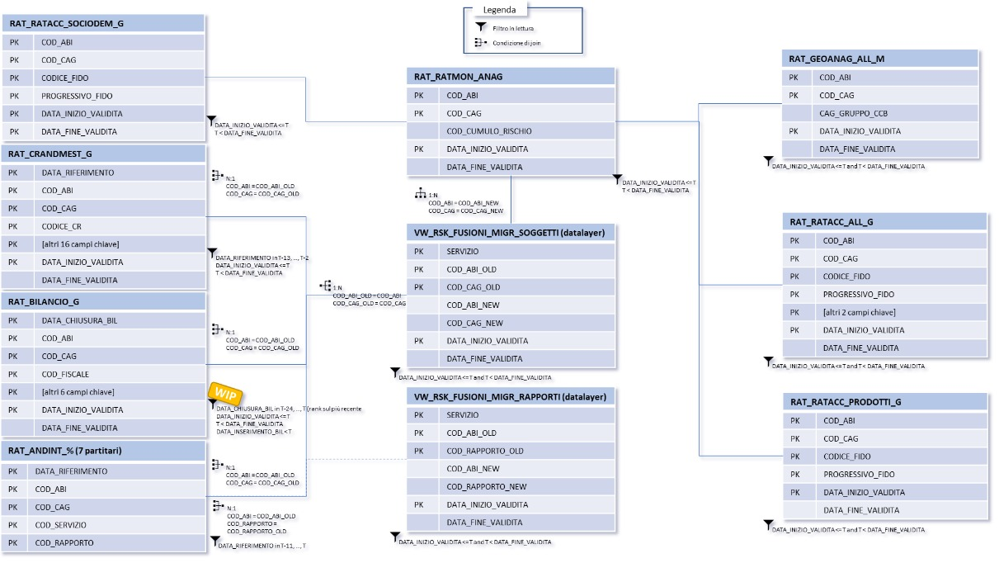

# Bank Rating Engine

## Overview
The **Bank Rating Engine** project is a data processing pipeline designed for a banking institution. This pipeline involves extracting data from a data warehouse in an Oracle database, transforming it using **Informatica PowerCenter**, and then loading the processed data back into Oracle target tables. The orchestration of **Informatica PowerCenter workflows** is managed using **Linux Korn Shell scripts**, automating the ETL process.

**Note:** This documentation represents only a small part of the overall project for demonstration purposes.

## Technologies Used
- **Informatica PowerCenter**: Used for ETL (Extract, Transform, Load) processes.  
  Example File: [Informatica Workflow Example](PowerCenter/wf_LOAD_ANDAMENTALE_INTERNO.XML)
  
- **Linux Korn Shell (KSH)**: For launching and managing **PowerCenter workflows**.  
  Example File: [Korn Shell Script Example](ScriptShell/load_table_motore_di_rating_andint.sh)
  
- **PL/SQL**: Utilized within Oracle for stored procedures, queries, and database management.  
  Example File: [PL/SQL Script Example](PLSQL/cr_prc_RSK_PRC_TRAS_MOT_RATING_TRUNC_PART_ABI.sql)

## Data Source
The data source for this project is a **data warehouse** stored within an **Oracle database**. This data warehouse contains various banking transaction details, customer information, and risk assessment metrics, which are extracted for further transformation and analysis.

## Data Model
The data model represents the structure of how the data is organized and processed throughout the ETL pipeline. Specifically, this data model depicts the **final data mart**, which consolidates relevant banking transaction details, customer information, and risk assessment metrics for analytical purposes.

The files provided for ETL processes serve solely as the provisioning mechanisms for populating the **RAT_ANDINT** table and his view, ensuring that the data is accurately transformed and loaded into the final data mart structure.

## Analysis
During the **functional analysis** phase of the project, SQL queries were designed based on business rules and data quality requirements. These queries were used to:
- **Extract** the initial dataset from the Oracle data warehouse.
- Serve as a **blueprint** for constructing the **Informatica PowerCenter mappings** that would perform the ETL process.
- Ensure **data quality** by validating the data before and after the transformation steps.

The functional analysis provided detailed business logic, which was converted into SQL queries that extracted the necessary fields and applied filters based on client requirements.

Example SQL query used for analysis and data quality:  
[SQL Query Example](AnalysisSQL/analisi_CREDITIDIFIRMA.sql)

This query served as the baseline for developing the mappings and transformations within PowerCenter, as well as for performing **data quality checks** to ensure the data met the business criteria.

## Usage Instructions

### 1. Extraction, Transformation, and Loading Using Informatica PowerCenter
The **ETL process** (extraction, transformation, and loading) is managed using **Informatica PowerCenter** workflows.

### 2. Automation with Linux Korn Shell (KSH)
The **Linux Korn Shell scripts** were used to automate the execution of PowerCenter workflows. These scripts ensure that the workflows for data extraction, transformation, and loading run in sequence, and that workflow execution is logged.

### 3. Running the Full ETL Workflow
For full automation, you can use a master Korn Shell script to launch all steps of the ETL process—extraction, transformation, and loading—by invoking the appropriate workflows in **Informatica PowerCenter**.

## Contact
For further questions, please contact:  
**Antonio Fiumanò**  
Data Engineer  
Email: [axelfiumano@gmail.com](mailto:axelfiumano@gmail.com)  
LinkedIn: [Antonio Fiumanò LinkedIn Profile](https://www.linkedin.com/in/antonio-fiumano-68aab419a)
